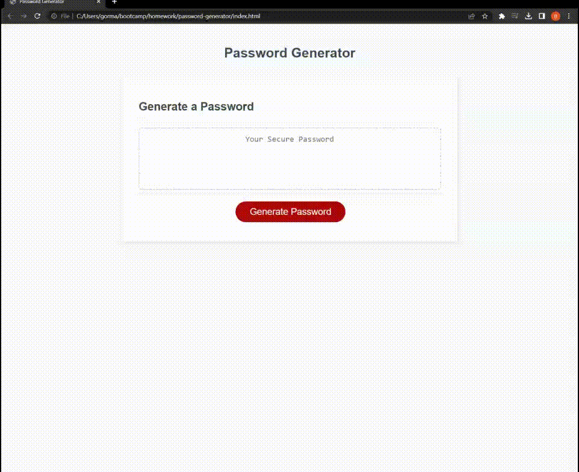
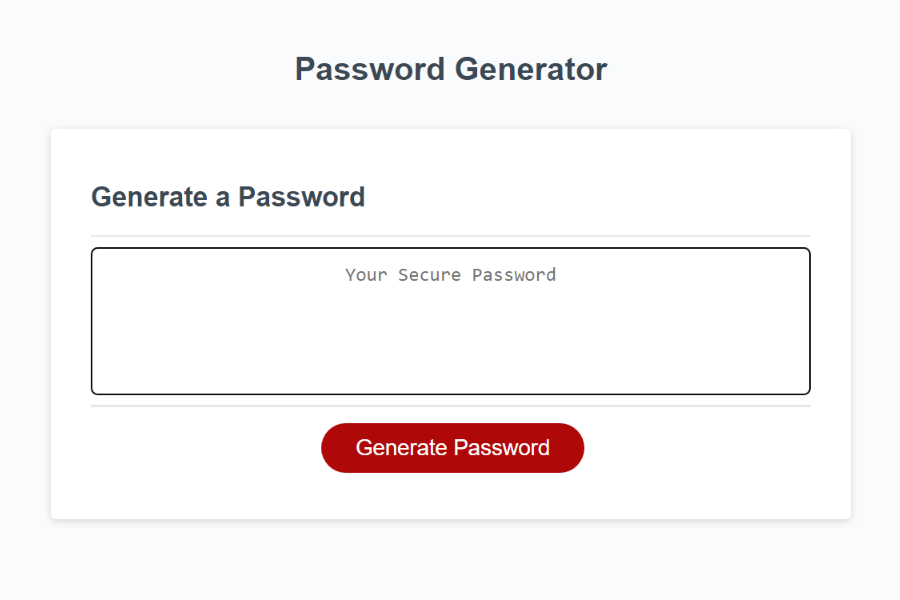
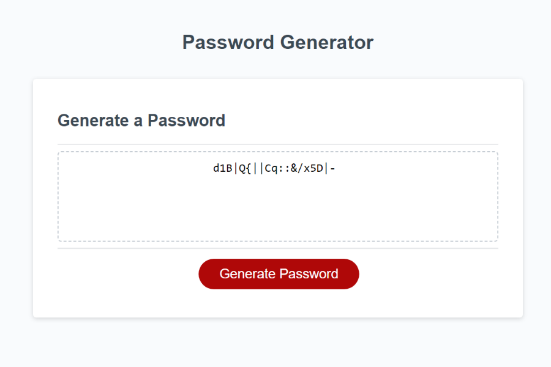

# Password Generator

## Description

When the user hits the **Generate Password** button they are presented with a series of browser alerts that prompt the user with character and length options.

## Character Types

- Lowercase letters
- Uppercase letters
- Numbers
- Special characters

## Usage

Visit the live site [here](https://GormanBrian.github.io/password-generator)

## Useful Links

- [Source code](https://github.com/coding-boot-camp/friendly-parakeet)
- See a list of special characters [here](https://owasp.org/www-community/password-special-characters)

---

## Screenshots

### Functioning Website

### Website w/out Password

### Website w/ Password

